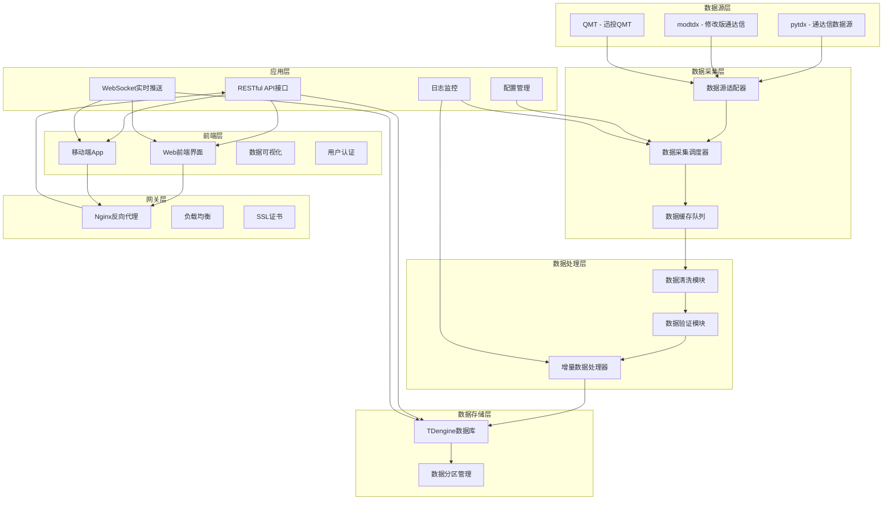
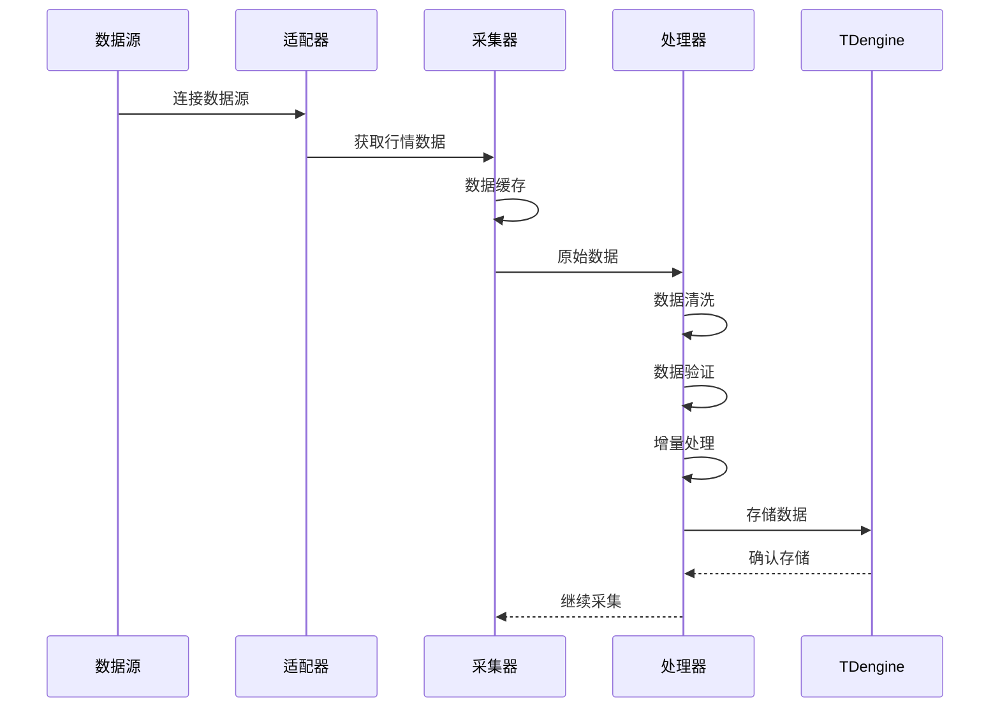

# 量化金融数据采集系统项目计划

## 项目概述

**项目名称**: 量化金融行情数据采集与存储系统

**项目目标**: 构建一个基于Docker的量化金融数据采集系统，支持多数据源（pytdx、modtdx、QMT等），实现股票和期货行情数据的采集、清洗和增量存储，使用TDengine作为时序数据库。

**技术栈**:
- 编程语言: Python 3.9+
- 容器化: Docker & Docker Compose
- 数据库: TDengine (时序数据库)
- 数据源: pytdx、modtdx、QMT
- 异步框架: asyncio/aiohttp
- 后端框架: FastAPI
- 前端框架: Vue 3 + Vite
- 移动端框架: React Native
- 实时通信: WebSocket
- 反向代理: Nginx
- 图表库: ECharts
- 状态管理: Vuex
- 路由: Vue Router

**测试环境**:
- 服务器: 192.168.6.8
- 用户: root
- 密码: lovemyself

## 系统架构

### 整体架构图



### 数据流程图



## 项目目录结构

```
TDengine/
├── docker/
│   ├── Dockerfile              # Python应用Docker镜像
│   ├── docker-compose.yml      # Docker编排配置
│   ├── nginx/
│   │   └── nginx.conf        # Nginx配置文件
│   └── tdengine/
│       └── Dockerfile          # TDengine Docker镜像
├── backend/                  # 后端服务（Python）
│   ├── __init__.py
│   ├── config/
│   │   ├── __init__.py
│   │   ├── settings.py         # 配置文件
│   │   └── database.py         # 数据库配置
│   ├── adapters/
│   │   ├── __init__.py
│   │   ├── base.py             # 基础适配器接口
│   │   ├── pytdx_adapter.py    # pytdx适配器
│   │   ├── modtdx_adapter.py   # modtdx适配器
│   │   └── qmt_adapter.py      # QMT适配器
│   ├── collectors/
│   │   ├── __init__.py
│   │   ├── scheduler.py        # 采集调度器
│   │   └── cache.py            # 数据缓存队列
│   ├── processors/
│   │   ├── __init__.py
│   │   ├── cleaner.py          # 数据清洗
│   │   ├── validator.py        # 数据验证
│   │   └── incremental.py      # 增量数据处理
│   ├── storage/
│   │   ├── __init__.py
│   │   ├── tdengine_client.py  # TDengine客户端
│   │   └── schema.py           # 数据库表结构
│   ├── models/
│   │   ├── __init__.py
│   │   ├── stock.py            # 股票数据模型
│   │   └── futures.py          # 期货数据模型
│   ├── api/
│   │   ├── __init__.py
│   │   ├── app.py             # FastAPI应用
│   │   ├── routes/
│   │   │   ├── __init__.py
│   │   │   ├── stock.py         # 股票数据API
│   │   │   ├── futures.py       # 期货数据API
│   │   │   ├── index.py         # 指数数据API
│   │   │   ├── sector.py        # 板块数据API
│   │   │   ├── collect.py       # 采集管理API
│   │   │   └── user.py          # 用户管理API
│   │   ├── schemas/
│   │   │   ├── __init__.py
│   │   │   ├── stock.py         # 股票数据Schema
│   │   │   ├── futures.py       # 期货数据Schema
│   │   │   └── user.py          # 用户Schema
│   │   └── websocket/
│   │       ├── __init__.py
│   │       └── manager.py        # WebSocket连接管理
│   ├── utils/
│   │   ├── __init__.py
│   │   ├── logger.py           # 日志工具
│   │   └── helpers.py          # 辅助函数
│   └── main.py                 # 主程序入口
├── frontend/                 # 前端服务（Vue3）
│   ├── public/
│   │   └── index.html
│   ├── src/
│   │   ├── main.js
│   │   ├── App.vue
│   │   ├── router/
│   │   │   └── index.js         # 路由配置
│   │   ├── store/
│   │   │   └── index.js         # Vuex状态管理
│   │   ├── api/
│   │   │   ├── index.js         # API请求封装
│   │   │   ├── stock.js         # 股票数据API
│   │   │   ├── futures.js       # 期货数据API
│   │   │   └── collect.js       # 采集管理API
│   │   ├── views/
│   │   │   ├── Dashboard.vue     # 仪表盘
│   │   │   ├── Stock/
│   │   │   │   ├── List.vue       # 股票列表
│   │   │   │   ├── Detail.vue     # 股票详情
│   │   │   │   ├── Quotes.vue     # 实时行情
│   │   │   │   ├── Kline.vue      # K线图表
│   │   │   │   └── Tick.vue       # Tick数据
│   │   │   ├── Futures/
│   │   │   │   ├── List.vue       # 期货列表
│   │   │   │   ├── Detail.vue     # 期货详情
│   │   │   │   ├── Quotes.vue     # 实时行情
│   │   │   │   └── Kline.vue      # K线图表
│   │   │   ├── Index/
│   │   │   │   ├── List.vue       # 指数列表
│   │   │   │   └── Detail.vue     # 指数详情
│   │   │   ├── Sector/
│   │   │   │   ├── List.vue       # 板块列表
│   │   │   │   └── Detail.vue     # 板块详情
│   │   │   ├── Collect/
│   │   │   │   ├── Status.vue     # 采集状态
│   │   │   │   ├── Config.vue     # 采集配置
│   │   │   │   └── Log.vue        # 采集日志
│   │   │   └── User/
│   │   │       ├── Login.vue      # 登录
│   │   │       └── Profile.vue    # 用户信息
│   │   ├── components/
│   │   │   ├── Chart/
│   │   │   │   ├── KlineChart.vue  # K线图表组件
│   │   │   │   ├── LineChart.vue  # 折线图组件
│   │   │   │   └── BarChart.vue   # 柱状图组件
│   │   │   ├── Table/
│   │   │   │   └── DataTable.vue  # 数据表格组件
│   │   │   └── Common/
│   │   │       ├── Header.vue     # 头部组件
│   │   │       └── Sidebar.vue   # 侧边栏组件
│   │   └── assets/
│   │       └── css/
│   │           └── style.css
│   ├── package.json
│   ├── vite.config.js
│   └── Dockerfile
├── mobile/                   # 移动端App（React Native）
│   ├── src/
│   │   ├── App.tsx
│   │   ├── navigation/
│   │   │   └── RootNavigator.tsx  # 导航配置
│   │   ├── screens/
│   │   │   ├── Dashboard/
│   │   │   │   └── DashboardScreen.tsx
│   │   │   ├── Stock/
│   │   │   │   ├── StockListScreen.tsx
│   │   │   │   ├── StockDetailScreen.tsx
│   │   │   │   └── StockQuotesScreen.tsx
│   │   │   ├── Futures/
│   │   │   │   ├── FuturesListScreen.tsx
│   │   │   │   └── FuturesDetailScreen.tsx
│   │   │   ├── Collect/
│   │   │   │   └── CollectStatusScreen.tsx
│   │   │   └── User/
│   │   │       ├── LoginScreen.tsx
│   │   │       └── ProfileScreen.tsx
│   │   ├── components/
│   │   │   ├── Chart/
│   │   │   │   ├── KlineChart.tsx
│   │   │   │   └── LineChart.tsx
│   │   │   └── Common/
│   │   │       └── Loading.tsx
│   │   ├── services/
│   │   │   └── api.ts          # API服务
│   │   └── store/
│   │       └── index.ts         # 状态管理
│   ├── package.json
│   └── tsconfig.json
├── tests/
│   ├── __init__.py
│   ├── test_adapters.py
│   ├── test_processors.py
│   └── test_storage.py
├── logs/
│   └── .gitkeep
├── data/
│   └── .gitkeep
├── requirements.txt            # Python依赖
├── .env.example                # 环境变量示例
├── .gitignore
├── README.md
└── plans/
    ├── 量化金融数据采集系统项目计划.md
    └── 数据源分析与表结构设计_详细注释版.md
```

## 前端架构设计

### Web前端架构（Vue3）

#### 技术栈
- **框架**: Vue 3 + Vite
- **状态管理**: Vuex 4
- **路由**: Vue Router 4
- **UI组件库**: Element Plus
- **图表库**: ECharts 5
- **HTTP客户端**: Axios
- **WebSocket**: 原生WebSocket API
- **构建工具**: Vite

#### 核心功能模块

**1. 仪表盘（Dashboard）**
- 系统概览
- 数据采集状态
- 数据质量监控
- 实时数据统计
- 系统性能指标

**2. 股票模块**
- 股票列表（支持搜索、筛选、排序）
- 股票详情（基本信息、财务数据、分红送配）
- 实时行情（十档买卖盘口、实时更新）
- K线图表（多周期切换、技术指标）
- Tick数据（逐笔成交明细）

**3. 期货模块**
- 期货列表（按交易所、品种分类）
- 期货详情（合约信息、持仓明细）
- 实时行情（十档买卖盘口、实时更新）
- K线图表（多周期切换、技术指标）
- Tick数据（逐笔成交明细）

**4. 指数模块**
- 指数列表（上证、深证、行业、概念）
- 指数详情（成分股、走势分析）
- K线图表（多周期切换）

**5. 板块模块**
- 板块列表（行业、概念）
- 板块详情（成分股、涨跌统计）
- 板块行情（实时更新）

**6. 采集管理模块**
- 采集状态（实时监控各数据源采集状态）
- 采集配置（配置数据源、采集频率、采集范围）
- 采集日志（查看采集日志、错误信息）
- 数据质量监控（完整性、准确性、及时性）

**7. 用户管理模块**
- 用户登录（JWT认证）
- 用户信息（个人资料、权限管理）
- 操作日志（用户操作记录）

#### 实时数据推送

**WebSocket连接管理**
- 自动重连机制
- 心跳检测
- 订阅管理（可订阅特定股票、期货的实时行情）
- 消息分发（将实时数据推送到对应组件）

**订阅主题**
- `stock:quotes:{symbol}` - 股票实时行情
- `stock:ticks:{symbol}` - 股票Tick数据
- `futures:quotes:{symbol}` - 期货实时行情
- `futures:ticks:{symbol}` - 期货Tick数据
- `collect:status` - 采集状态更新
- `collect:log` - 采集日志更新

#### 数据可视化

**K线图表组件（KlineChart.vue）**
- 支持多周期（1分钟、5分钟、15分钟、30分钟、60分钟、日K、周K、月K）
- 技术指标（MA、MACD、KDJ、RSI、BOLL等）
- 缩放、平移
- 十字光标显示详细信息

**折线图组件（LineChart.vue）**
- 多数据系列
- 自定义颜色、样式
- 缩放、平移

**柱状图组件（BarChart.vue）**
- 多维度数据展示
- 自定义颜色、样式
- 缩放、平移

#### 响应式设计

- 支持PC、平板、手机访问
- 自适应布局
- 移动端优化（触摸操作、手势支持）

### 移动端App架构（React Native）

#### 技术栈
- **框架**: React Native 0.72+
- **导航**: React Navigation 6
- **状态管理**: Redux Toolkit
- **UI组件库**: React Native Paper
- **图表库**: Victory Native
- **HTTP客户端**: Axios
- **WebSocket**: 原生WebSocket API

#### 核心功能模块

**1. 仪表盘（DashboardScreen）**
- 系统概览
- 数据采集状态
- 快速访问常用功能

**2. 股票模块**
- 股票列表（支持搜索、筛选）
- 股票详情
- 实时行情（WebSocket实时推送）
- K线图表
- 添加自选股

**3. 期货模块**
- 期货列表
- 期货详情
- 实时行情（WebSocket实时推送）
- K线图表
- 添加自选合约

**4. 采集管理模块**
- 采集状态监控
- 采集配置管理
- 采集日志查看

**5. 用户管理模块**
- 用户登录
- 用户信息
- 设置（通知、主题等）

#### 实时数据推送

**WebSocket连接管理**
- 自动重连机制
- 心跳检测
- 订阅管理
- 后台运行支持

#### 跨平台支持

- iOS（iPhone、iPad）
- Android（手机、平板）
- 响应式布局

### 后端API设计（FastAPI）

#### 技术栈
- **框架**: FastAPI 0.100+
- **ORM**: 无（直接使用TDengine客户端）
- **认证**: JWT
- **文档**: Swagger/OpenAPI
- **CORS**: 支持跨域请求
- **WebSocket**: FastAPI WebSocket

#### API模块

**1. 股票数据API（routes/stock.py）**
```python
# 获取股票列表
GET /api/v1/stocks

# 获取股票详情
GET /api/v1/stocks/{symbol}

# 获取股票实时行情
GET /api/v1/stocks/{symbol}/quotes

# 获取股票K线数据
GET /api/v1/stocks/{symbol}/bars
参数: interval（1min、5min、15min、30min、60min、1day、1week、1month）
      start_time, end_time

# 获取股票Tick数据
GET /api/v1/stocks/{symbol}/ticks
参数: start_time, end_time, limit

# 获取股票分时数据
GET /api/v1/stocks/{symbol}/intraday
参数: date

# 获取股票基本信息
GET /api/v1/stocks/{symbol}/info

# 获取股票财务数据
GET /api/v1/stocks/{symbol}/financial
参数: start_date, end_date

# 获取股票分红送配
GET /api/v1/stocks/{symbol}/dividend
参数: start_year, end_year

# 获取股票资金流向
GET /api/v1/stocks/{symbol}/money-flow
参数: start_date, end_date
```

**2. 期货数据API（routes/futures.py）**
```python
# 获取期货列表
GET /api/v1/futures

# 获取期货详情
GET /api/v1/futures/{symbol}

# 获取期货实时行情
GET /api/v1/futures/{symbol}/quotes

# 获取期货K线数据
GET /api/v1/futures/{symbol}/bars
参数: interval, start_time, end_time

# 获取期货Tick数据
GET /api/v1/futures/{symbol}/ticks
参数: start_time, end_time, limit

# 获取期货合约信息
GET /api/v1/futures/{symbol}/contract

# 获取期货持仓明细
GET /api/v1/futures/{symbol}/position-detail
参数: date
```

**3. 指数数据API（routes/index.py）**
```python
# 获取指数字列
GET /api/v1/indices

# 获取指数字节
GET /api/v1/indices/{symbol}

# 获取指数字时行情
GET /api/v1/indices/{symbol}/quotes

# 获取指数字K线数据
GET /api/v1/indices/{symbol}/bars
参数: interval, start_time, end_time
```

**4. 板块数据API（routes/sector.py）**
```python
# 获取板块列表
GET /api/v1/sectors

# 获取板块详情
GET /api/v1/sectors/{name}

# 获取板块实时行情
GET /api/v1/sectors/{name}/quotes
```

**5. 采集管理API（routes/collect.py）**
```python
# 获取采集状态
GET /api/v1/collect/status

# 启动采集任务
POST /api/v1/collect/start
Body: { data_source, data_type, symbols }

# 停止采集任务
POST /api/v1/collect/stop
Body: { task_id }

# 获取采集配置
GET /api/v1/collect/config

# 更新采集配置
PUT /api/v1/collect/config
Body: { data_source, config }

# 获取采集日志
GET /api/v1/collect/logs
参数: start_time, end_time, level, limit

# 获取数据质量报告
GET /api/v1/collect/quality
参数: symbol, start_time, end_time
```

**6. 用户管理API（routes/user.py）**
```python
# 用户登录
POST /api/v1/auth/login
Body: { username, password }

# 用户登出
POST /api/v1/auth/logout

# 获取用户信息
GET /api/v1/users/me

# 更新用户信息
PUT /api/v1/users/me
Body: { email, phone, etc. }

# 修改密码
POST /api/v1/users/change-password
Body: { old_password, new_password }
```

#### WebSocket API

**连接端点**
```
ws://192.168.6.8:8000/ws
```

**订阅消息格式**
```json
{
  "action": "subscribe",
  "topic": "stock:quotes:000001",
  "token": "jwt_token"
}
```

**取消订阅消息格式**
```json
{
  "action": "unsubscribe",
  "topic": "stock:quotes:000001",
  "token": "jwt_token"
}
```

**实时数据推送格式**
```json
{
  "topic": "stock:quotes:000001",
  "data": {
    "ts": "2024-01-01T10:00:00",
    "symbol": "000001",
    "open": 10.50,
    "high": 10.80,
    "low": 10.30,
    "close": 10.70,
    "volume": 1000000,
    "amount": 10700000.00,
    "bid_price1": 10.68,
    "ask_price1": 10.71,
    ...
  }
}
```

#### 认证机制

**JWT认证**
- 用户登录后返回JWT Token
- Token有效期：24小时
- Token刷新机制
- API请求Header：`Authorization: Bearer {token}`

**权限管理**
- 管理员：所有权限
- 普通用户：只读权限
- 交易用户：读写权限（QMT数据）

### Nginx配置

#### 反向代理配置

```nginx
# HTTP服务器配置
server {
    listen 80;
    server_name 192.168.6.8;

    # 前端静态文件
    location / {
        root /usr/share/nginx/html;
        index index.html;
        try_files $uri $uri/ /index.html;
    }

    # 后端API代理
    location /api/ {
        proxy_pass http://backend:8000;
        proxy_set_header Host $host;
        proxy_set_header X-Real-IP $remote_addr;
        proxy_set_header X-Forwarded-For $proxy_add_x_forwarded_for;
        proxy_set_header X-Forwarded-Proto $scheme;
    }

    # WebSocket代理
    location /ws {
        proxy_pass http://backend:8000;
        proxy_http_version 1.1;
        proxy_set_header Upgrade $http_upgrade;
        proxy_set_header Connection "upgrade";
        proxy_set_header Host $host;
        proxy_set_header X-Real-IP $remote_addr;
    }
}

# HTTPS配置（可选）
server {
    listen 443 ssl;
    server_name 192.168.6.8;

    ssl_certificate /etc/nginx/ssl/cert.pem;
    ssl_certificate_key /etc/nginx/ssl/key.pem;

    # 其他配置同上
}
```

#### 负载均衡（可选，多实例部署）

```nginx
upstream backend {
    server backend1:8000;
    server backend2:8000;
    server backend3:8000;
}

server {
    location /api/ {
        proxy_pass http://backend;
        # 其他配置
    }
}
```

### 前后端交互流程图

```mermaid
sequenceDiagram
    participant U as 用户
    participant W as Web前端
    participant M as 移动端App
    participant N as Nginx
    participant B as 后端API
    participant T as TDengine
    participant WS as WebSocket

    U->>W: 访问Web界面
    M->>W: 打开App

    W->>N: 请求静态资源
    M->>N: 请求静态资源
    N-->>W: 返回静态资源
    N-->>M: 返回静态资源

    W->>N: API请求（认证）
    M->>N: API请求（认证）
    N->>B: 转发API请求
    B->>T: 查询数据
    T-->>B: 返回数据
    B-->>N: 返回响应
    N-->>W: 返回响应
    N-->>M: 返回响应

    W->>WS: 建立WebSocket连接
    M->>WS: 建立WebSocket连接
    WS-->>W: 实时数据推送
    WS-->>M: 实时数据推送

    Note over W, M, WS: 支持多端同时访问
```

### 前端扩展性设计

#### 组件化架构
- 可复用组件库（Chart、Table、Common）
- 按功能模块划分（Stock、Futures、Index、Sector、Collect、User）
- 统一API封装（api/index.js、api/stock.js等）

#### 状态管理
- Vuex Store模块化（stock、futures、index、sector、collect、user）
- 持久化存储（localStorage、sessionStorage）
- 响应式状态更新

#### 路由设计
- 懒加载（按需加载）
- 路由守卫（认证、权限）
- 动态路由（根据用户权限动态加载）

#### 移动端扩展
- 共享API服务（Web和App使用相同的后端API）
- 共享WebSocket连接管理
- 统一认证机制
- 响应式设计（适配不同屏幕尺寸）

#### 性能优化
- 虚拟滚动（大数据量表格）
- 图表懒加载
- 图片懒加载
- CDN加速（静态资源）
- 缓存策略（API响应缓存）

---

## 核心功能模块

### 1. 数据源适配器 (adapters/)

**职责**: 封装不同数据源的接口，提供统一的数据获取方式

**接口设计**:
```python
class BaseAdapter(ABC):
    @abstractmethod
    async def connect(self) -> bool
    @abstractmethod
    async def disconnect(self)
    @abstractmethod
    async def get_stock_quotes(self, symbols: List[str]) -> List[Quote]
    @abstractmethod
    async def get_futures_quotes(self, symbols: List[str]) -> List[Quote]
    @abstractmethod
    async def get_historical_data(self, symbol: str, start: datetime, end: datetime) -> List[Bar]
```

**实现类**:
- `PytdxAdapter`: pytdx数据源适配
- `ModtdxAdapter`: modtdx数据源适配
- `QmtAdapter`: QMT数据源适配

### 2. 数据采集调度器 (collectors/)

**职责**: 管理数据采集任务，调度多个数据源，处理数据缓存

**核心功能**:
- 定时任务调度
- 多数据源并发采集
- 数据缓存队列
- 失败重试机制
- 采集状态监控

### 3. 数据处理模块 (processors/)

#### 3.1 数据清洗 (cleaner.py)
- 去除重复数据
- 处理缺失值
- 数据格式标准化
- 异常值检测

#### 3.2 数据验证 (validator.py)
- 数据完整性检查
- 数据类型验证
- 业务规则验证
- 数据一致性检查

#### 3.3 增量数据处理 (incremental.py)
- 获取最新数据时间戳
- 计算增量数据范围
- 增量数据采集
- 数据去重合并

### 4. 数据存储模块 (storage/)

#### 4.1 TDengine客户端 (tdengine_client.py)
- 连接池管理
- 批量写入优化
- 查询接口封装
- 连接异常处理

#### 4.2 数据库表结构 (schema.py)

根据pytdx、modtdx、QMT数据源的特点，设计以下完善的TDengine表结构：

参考另一个文件： 数据源分析与表结构设计_详细注释版.md

```

## Docker配置

### Docker Compose服务

```yaml
version: '3.8'

services:
  # TDengine数据库服务
  tdengine:
    image: tdengine/tdengine:3.0
    container_name: quant_tdengine
    environment:
      - TAOS_FQDN=tdengine
    ports:
      - "6030:6030"
      - "6041:6041"
    volumes:
      - tdengine_data:/var/lib/taos
    networks:
      - quant_network
    restart: unless-stopped

  # Python后端API服务
  backend:
    build:
      context: ./backend
      dockerfile: ../docker/Dockerfile.backend
    container_name: quant_backend
    environment:
      - TDENGINE_HOST=tdengine
      - TDENGINE_PORT=6030
      - TDENGINE_USER=root
      - TDENGINE_PASSWORD=taosdata
      - TDENGINE_DATABASE=quant_db
      - JWT_SECRET_KEY=${JWT_SECRET_KEY:-your-secret-key}
      - JWT_ALGORITHM=HS256
      - ACCESS_TOKEN_EXPIRE_MINUTES=1440
    volumes:
      - ./backend:/app
      - ./logs:/app/logs
      - ./data:/app/data
    depends_on:
      - tdengine
    networks:
      - quant_network
    restart: unless-stopped
    healthcheck:
      test: ["CMD", "curl", "-f", "http://localhost:8000/health"]
      interval: 30s
      timeout: 10s
      retries: 3

  # Vue3前端Web服务
  frontend:
    build:
      context: ./frontend
      dockerfile: ../docker/Dockerfile.frontend
    container_name: quant_frontend
    ports:
      - "80:80"
    volumes:
      - ./frontend:/app
      - ./nginx:/etc/nginx/conf.d
    depends_on:
      - backend
    networks:
      - quant_network
    restart: unless-stopped

  # Nginx反向代理服务
  nginx:
    image: nginx:alpine
    container_name: quant_nginx
    ports:
      - "8080:80"
      - "443:443"
    volumes:
      - ./docker/nginx/nginx.conf:/etc/nginx/nginx.conf:ro
      - ./docker/nginx/ssl:/etc/nginx/ssl:ro
      - ./frontend/dist:/usr/share/nginx/html:ro
    depends_on:
      - frontend
      - backend
    networks:
      - quant_network
    restart: unless-stopped

networks:
  quant_network:
    driver: bridge

volumes:
  tdengine_data:
```

### Dockerfile配置

#### 1. Python后端Dockerfile (docker/Dockerfile.backend)

```dockerfile
FROM python:3.9-slim

WORKDIR /app

# 安装系统依赖
RUN apt-get update && apt-get install -y \
    gcc \
    g++ \
    curl \
    && rm -rf /var/lib/apt/lists/*

# 复制requirements.txt
COPY backend/requirements.txt .

# 安装Python依赖
RUN pip install --no-cache-dir -r requirements.txt

# 复制后端代码
COPY backend/ .

# 暴露端口
EXPOSE 8000

# 健康检查
HEALTHCHECK --interval=30s --timeout=10s --start-period=5s --retries=3 \
    CMD curl -f http://localhost:8000/health || exit 1

# 启动命令
CMD ["uvicorn", "api.app:app", "--host", "0.0.0.0", "--port", "8000"]
```

#### 2. Vue3前端Dockerfile (docker/Dockerfile.frontend)

```dockerfile
FROM node:18-alpine as builder

WORKDIR /app

# 复制package.json和package-lock.json
COPY frontend/package*.json ./

# 安装依赖
RUN npm ci

# 复制源代码
COPY frontend/ .

# 构建生产版本
RUN npm run build

# Nginx阶段
FROM nginx:alpine

# 复制构建产物
COPY --from=builder /app/dist /usr/share/nginx/html

# 复制Nginx配置
COPY docker/nginx/default.conf /etc/nginx/conf.d/default.conf

# 暴露端口
EXPOSE 80

# 启动Nginx
CMD ["nginx", "-g", "daemon off;"]
```

#### 3. Nginx配置文件 (docker/nginx/default.conf)

```nginx
server {
    listen 80;
    server_name localhost;
    root /usr/share/nginx/html;
    index index.html;

    # Gzip压缩
    gzip on;
    gzip_types text/plain text/css application/json application/javascript text/xml application/xml application/xml+rss text/javascript;
    gzip_min_length 1000;
    gzip_comp_level 6;

    # 前端路由
    location / {
        try_files $uri $uri/ /index.html;
    }

    # API代理到后端
    location /api/ {
        proxy_pass http://backend:8000;
        proxy_set_header Host $host;
        proxy_set_header X-Real-IP $remote_addr;
        proxy_set_header X-Forwarded-For $proxy_add_x_forwarded_for;
        proxy_set_header X-Forwarded-Proto $scheme;
        proxy_buffering off;
    }

    # WebSocket代理到后端
    location /ws {
        proxy_pass http://backend:8000;
        proxy_http_version 1.1;
        proxy_set_header Upgrade $http_upgrade;
        proxy_set_header Connection "upgrade";
        proxy_set_header Host $host;
        proxy_set_header X-Real-IP $remote_addr;
    }
}
```

#### 4. 移动端React Native构建配置

移动端React Native项目不需要Docker容器化，使用以下方式构建和部署：

**Android构建**:
```bash
cd mobile
npm run android
```

**iOS构建**:
```bash
cd mobile
npx react-native run-ios
```

**APK构建**:
```bash
cd mobile/android
./gradlew assembleRelease
```

**IPA构建**:
```bash
cd mobile/ios
npx react-native run-ios --configuration Release
```

## 配置管理

### 环境变量 (.env)

```env
# TDengine配置
TDENGINE_HOST=tdengine
TDENGINE_PORT=6030
TDENGINE_USER=root
TDENGINE_PASSWORD=taosdata
TDENGINE_DATABASE=quant_db

# 数据源配置
PYTDX_HOSTS=119.147.212.81,60.12.136.250
PYTDX_PORT=7709
QMT_PATH=/data/qmt

# 采集配置
COLLECT_INTERVAL=5  # 秒
MAX_RETRY=3
BATCH_SIZE=1000
CACHE_SIZE=10000

# 日志配置
LOG_LEVEL=INFO
LOG_FILE=/app/logs/collector.log
```

## 实施步骤

### 阶段1: 项目基础搭建
1. 创建项目目录结构
2. 配置Python虚拟环境
3. 创建requirements.txt
4. 编写基础配置文件

### 阶段2: 数据库设计
1. 设计TDengine表结构
2. 创建数据库初始化脚本
3. 编写TDengine客户端封装

### 阶段3: 数据源适配器
1. 实现基础适配器接口
2. 实现pytdx适配器
3. 实现modtdx适配器
4. 实现QMT适配器

### 阶段4: 数据采集模块
1. 实现采集调度器
2. 实现数据缓存队列
3. 实现定时任务调度

### 阶段5: 数据处理模块
1. 实现数据清洗功能
2. 实现数据验证功能
3. 实现增量数据处理

### 阶段6: Docker容器化
1. 编写Dockerfile
2. 编写docker-compose.yml
3. 配置网络和存储卷

### 阶段7: 测试和文档
1. 编写单元测试
2. 集成测试
3. 编写使用文档
4. 编写部署文档

## 技术要点

### 1. 异步编程
- 使用asyncio实现异步数据采集
- 使用aiohttp处理HTTP请求
- 使用asyncio.Queue实现数据缓存

### 2. 数据库优化
- TDengine批量写入优化
- 合理设计超级表和子表
- 使用标签(Tags)优化查询性能

### 3. 容错机制
- 数据源连接失败重试
- 数据写入失败重试
- 异常日志记录和告警

### 4. 性能优化
- 数据采集并发控制
- 批量写入减少IO
- 内存缓存队列优化

## 部署说明

### 前置条件
- Docker和Docker Compose已安装
- 服务器192.168.6.8可访问
- 数据源API可访问

### 部署步骤
1. 克隆项目到服务器
2. 配置.env文件
3. 构建Docker镜像
4. 启动服务
5. 验证数据采集

### 启动命令
```bash
# 构建镜像
docker-compose build

# 启动服务
docker-compose up -d

# 查看日志
docker-compose logs -f quant_app

# 停止服务
docker-compose down
```

## 监控和维护

### 日志监控
- 采集成功率
- 数据写入成功率
- 异常错误统计

### 数据质量监控
- 数据完整性检查
- 数据延迟监控
- 数据一致性验证

### 系统维护
- 定期数据备份
- 日志清理
- 性能调优

## 扩展性考虑

### 数据源扩展
- 新增数据源只需实现BaseAdapter接口
- 支持插件式数据源加载

### 数据类型扩展
- 支持更多市场数据（期权、债券等）
- 支持更多数据频率（tick、1分钟、5分钟等）

### 功能扩展
- 数据分析模块
- 策略回测模块
- 实时交易模块
- 数据可视化模块
